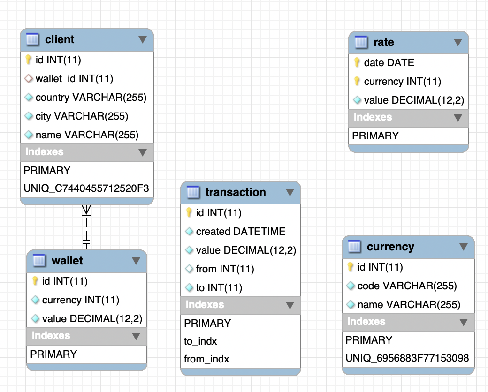

### Простая платёжная система
Тестовое задание
---
####Сборка проекта - 
make envbuild envstart init

Это запустит запуск докер контейнера, поднимет докер-композ с БД, подтянет зависимости symfony, сгенерирует набор тестовых данных и поднимет проект на 80 порту.
Список реализованных API в swagger доступен на http://localhost/api/doc

На полноценный фронтенд на React/Vue etc. времени к сожалению не хватило, пункт тз реализован на TWIG
Пример отчета будет доступен по ссылке, например -
http://localhost/api/report/view/16?from=2019-01-01&to=2020-12-20 (так же есть в swagger  формате по ссылке выше)

---
####Комментарии:

1. «Перевод в валюте получателя или отправителя» условие имеет значение только в API транзакций(переводов), т.к. кошелёк по условию хранит значение в одной валюте. ТЗ не содержит явного указания что валюта транзакции пользователя где-то пригодится, хотя в реальных системах, скорее всего, эта информация важна. Буду хранить в USD, т.к. в любой транзакции будет идти пересчет через эту валюту. В некоторых случаях это приведет к изменению суммы транзакции начального запроса.
2. «Необходимо также вывести общую сумму операций по счету за период в USD и валюте счета» - то что отчет строится «за период» затрудняет кэширование промежуточных вычислений. Проблема отчета в доп. условии «сумма операций по счету за период в USD и валюте счета», сумма операций в USD означает необходимость делать пересчет валюты операции за каждый день, в который она приходила, и последующем суммировании. Впрочем, раз транзакции хранятся в USD, эта проблема уходит. Возможно было использовать несколько подходов:
    1. Транзакция записывается в универсальном виде (валюта, сумма, от, кому) и вычисления для отчета строятся с помощью хранимых процедур.
    2. В момент транзакции делаем дублирующие (по смыслу) данные, для удобства построения отчета. В условия когда курс один на весь день, можно это сделать. Например дополнить транзакцию столбцами с данными по транзакции в USD и обоих валютах - начальной и конечной.
    3. Транзакция записывается в универсальном виде (валюта, сумма, от, кому) и вычисления для отчета делаются на бэкенде системы. Больше объем передаваемых данных, но меньше зависимость от БД, не заставляем БД заниматься вычислениями (которые она в общем то делает неплохо, и возможно быстрее чем мы будем на PHP получать данные и обрабатывать их).
2. Каждое из решений имеет право на жизнь в зависимости от профиля использования системы и баланса количество операций/количество отчетов. Вероятно в реальной системе отчеты по произвольной дате строятся реже, чем используется функционал транзакций. Часто в интерфейсе подобных систем я вижу готовые элементы таких отчетов «за месяц», «за год», которые можно рассчитывать заранее в моменты наименьшей нагрузки, или хранить отдельно и дополнять их в момент транзакции, или отдельной подсистемой.
7. У меня нет практического опыта округлений значений банковских транзакций, насколько я помню у фин. операций есть свои нюансы округлений значений и т.д., для простоты я храню курсы и суммы в формате DECIMAL 19,2, и считаю что стандартные математические операции удовлетворяют предметной области.
8. В ходе решения натолкнулся на интересное ограничение Doctrine - она не умеет изкоробки поддерживать DAte/Datetime столбец как часть составного ключа. Пришлось писать свою обертку умеющую приводить значение к строке (src/Type/ORMDateType.php, src/Component/ORMDate.php)
9. В ходе разборок как лучше делать JOIN между Date и DateTime пользовался разбором со stackoverflow(https://dba.stackexchange.com/questions/51340/should-i-join-datetime-to-a-date-using-cast-or-range), сам бенчмарки построить не успел
11. У контроллеров фактически отсутствует всяческая проверка на входящие данные, разуемеется её надо дописать и выдавать понятные ошибки
1. К плюсам решения отношу минималистичность полученной схемы, возможность быстрого изменения функционала кошельков (добавление возможности каждому клиенту иметь несколько кошельков).
1. К минусам - нюансы с doctrine и тетсовым окружением и генерацие данных заняли больше времени чем я рассчитывал, и сам код решения стоило бы доработать ещё немного. Так же часть связей внутри таблиц не зафиксировал в виде явных внешних ключей. Страны и города также просятся во внешние сущности. Система не готова к изменениям курсов в течение дня. Так же некоторые параметры захардкожены, особенно в фикстурах. Это позволяет отработать им корректно один раз, но не более. Их так же нужно доработать.
2. Спорные решения - перевод транзакции в моей реализации делает 5 запроса (проверка существования кошелька начального, конечного, курсов их валют, и создание самой транзакции). С одной стороны - это много, и можно уместить эту операцию в один sql запрос, с другой стороны - так проще проверять данные и давать корректную обратную связь.